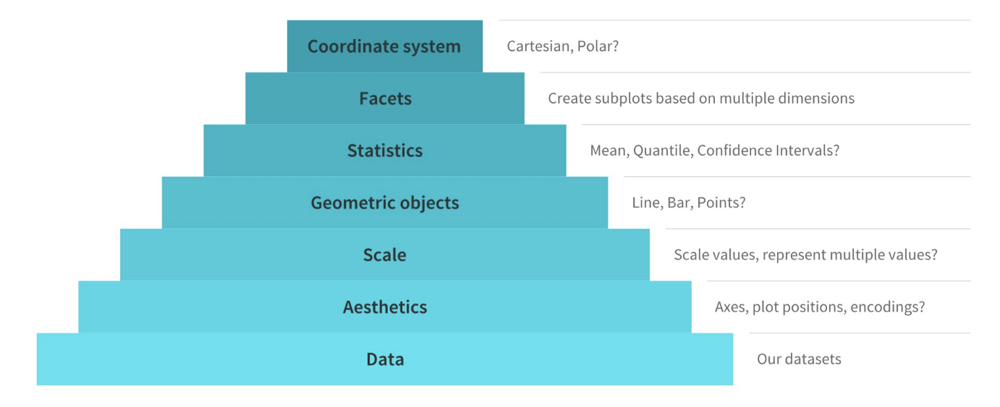

```{r setup, include=FALSE}
knitr::opts_chunk$set(echo = TRUE)
```

## 1. Abschluss

* Letzte Fragen? 
* Feedback
* "Afterhour" im r-tutorium-Repository

## 2. Grafiken erstellen mit ggplot2

### 2.1 Einstieg: ggplot2 

Im Laufe des Semesters haben wir schon gelegentlich auf Funktionen aus dem dem Paket ``ggplot2`` zurückgegriffen. Mit diesem Paket lassen sich eine Vielzahl an Grafiken erstellen und flexibel anpassen. In der offiziellen Dokumentation wird das Paket wie folgt definiert: 

>ggplot2 is a system for declaratively creating graphics, based on The Grammar of Graphics. You provide the data, tell ggplot2 how to map variables to aesthetics, what graphical primitives to use, and it takes care of the details.

Quelle: [https://ggplot2.tidyverse.org/](https://ggplot2.tidyverse.org/)

* Offizielle Dokumentation: [https://ggplot2.tidyverse.org/](https://ggplot2.tidyverse.org/)
* R Graph Gallery ggplot2: [https://r-graph-gallery.com/ggplot2-package.html](https://r-graph-gallery.com/ggplot2-package.html)
* Tutorial: [Grafiken mit ggplot2](https://methodenlehre.github.io/einfuehrung-in-R/grafiken-mit-ggplot2.html)
* Leitfaden: [Grammar of Graphics](https://towardsdatascience.com/a-comprehensive-guide-to-the-grammar-of-graphics-for-effective-visualization-of-multi-dimensional-1f92b4ed4149)
* Download: [ggplot2 cheatsheet](https://github.com/rstudio/cheatsheets/blob/main/data-visualization-2.1.pdf)


### 2.2 Prinzip "Grammar of Graphics"

Das Prinzip, das der deklarativen Erstellung von Grafiken zugrundeliegt, nennt sich "Grammar of Graphics". Diese "Grammatik" legt fest, wie die einzelnen Bestandteile einer Grafik beschrieben und konstruiert werden können. Konkret bedeutet das, dass bei der deklarativen Erstellung von Grafiken mit ggplot2 die Grafik in mehreren, übereinanderliegende Ebenen erstellt wird.    


Quelle: [towardsdatascience.com](https://towardsdatascience.com/a-comprehensive-guide-to-the-grammar-of-graphics-for-effective-visualization-of-multi-dimensional-1f92b4ed4149)


### 2.3 Workflow: ggplot2-Grafik erstellen

Der Workflow zur Erstellung einer ggplot2-Grafik sieht demnach wie folgt aus: 

Wie immer müssen wir zunächst das Paket installieren und laden:

```{r message=FALSE, results='hide'}
install.packages("ggplot2", repos="http://cran.us.r-project.org") 
library(ggplot2)
```


Als Beispiel-Datensatz verwenden wir den mitgelieferten Datensatz "presidential", der Daten zu den Amtszeiten aller US-Präsidenten von Eisenhower bis Obama enthält. Wir machen uns zuerst mit den Daten vertraut: 

```{r}

print(presidential)
```

Wir wollen später auch die Länge der Amtszeit visualisieren und fügen eine neue Spalte mit den Amtszeiten der Präsidenten hinzu. Da Bush in unserer Tabelle zweimal vorkommt, fügen wir dem Namen eine Zahl hinzu, um die Amtszeiten zu unterscheiden: 

```{r}

presi_df <- presidential
presi_df$term <- presi_df$end - presi_df$start
presi_df [8,1] <- "Bush_1"
presi_df [10,1] <- "Bush_2"
print(presi_df)
```

Zum Erstellen unserer Grafik stehen uns jetzt also die Spalten "name", "start", "end", "party" und "term" zur Verfügung. Zunächst übergeben wir der Grundfunktion ``ggplot()`` unsere Daten als erste Ebene:  

```{r message=FALSE, results='hide'}

ggplot(data=presi_df)
```
Die Funktion ``ggplot()`` produziert anders als die R-base-Funktion ``plot()`` so noch keine Grafik, weil hier die Grafikelemente wie bereits erläutert nicht vordefiniert sind und als Ebenen manuell hinzugefügt werden. 

Als zweites Argument werden der Funktion zunächst die "Aesthetics" übergeben, die festlegen, welche Variablen aus unseren Daten für die Visualisierung verwendet werden sollen.

```{r message=FALSE}

ggplot(data=presi_df, mapping=aes(x=name, 
                                  y=term)) 
```
Diese Grafik ist immer noch leer, weil es noch keine Ebene gibt, die definiert, was für eine Art Plot erstellt werden soll. Um die Datenpunkte zu plotten und die Grafik weiter anzupassen, können nun Grafikelemente mithilfe eines ``+``-Operators als neue Ebenenen auf das Plot-Objekt gelegt werden. Zum Plotten der Daten stehen verschiedene Funktionen, die alle mit ``geom`` beginnen, zur Verfügung.

```{r message=FALSE}

p <- ggplot(data=presi_df, mapping=aes(x=name,
                                   y=term)) 
p + geom_bar(fill = "lightblue", color = "black", stat="identity")
```

Die Grafik kann mithilfe zusätzlicher Ebenen und Parameter weiter angepasst werden: 

```{r }

p <- ggplot(data=presi_df, mapping=aes(x=name,
                                   y=term,
                                   fill=party)) 
p + geom_bar(stat="identity") +
  labs(x="Präsident", y="Amtszeit", title="Amtszeit der US-Präsidenten", fill="Partei") +
  scale_y_continuous(breaks = seq(0, 3000, by = 365)) +
  scale_x_discrete(guide = guide_axis(angle = 90))
```
Zur besseren Lesbarkeit wurde die Beschriftung der x-Achse mit dem Argument "guide_axis(angle=90)" rotiert. Denkbar wäre aber zum Beispiel auch, die Achsen zu vertauschen: 

```{r }
p <- ggplot(data=presi_df, mapping=aes(x=name,
                                   y=term,
                                   fill=party)) 
p + geom_bar(stat="identity") +
  labs(x="Präsident", y="Amtszeit", title="Amtszeit der US-Präsidenten", fill="Partei") +
  scale_y_continuous(breaks = seq(0, 3000, by = 365)) + 
  coord_flip()
```

## 3. Interaktive Visualisierungen 

### 3.1 plotly

Zum Erstellen interaktiver Visualisierungen kann beispielsweise das Paket [``plotly``](https://pandar.netlify.app/post/ggplotting-plotly/) verwendet werden. Mit der Funktion ``ggplotly()`` kann ein ggplot-Objekt in einen interaktiven Plot umgewandelt werden. 

Zunächst installieren und laden wir wieder das Paket: 

```{r message=FALSE, results='hide'}
install.packages("plotly", repos="http://cran.us.r-project.org")
library(plotly)
```

ggplot-Objekt mit allen Ebenen speichern und in plotly-Objekt umwandeln: 

```{r }
p <- ggplot(data=presi_df, mapping=aes(x=name,
                                   y=term,
                                   fill=party)) +
  geom_bar(stat="identity") +
  labs(x="Präsident", y="Amtszeit", title="Amtszeit der US-Präsidenten", fill="Partei") +
  scale_y_continuous(breaks = seq(0, 3000, by = 365)) + 
  coord_flip()


ggplotly(p)
```

### 3.2 shiny

Für komplexere Visualisierungen, die User:innen erlauben, den Input und verschiedene Inputparameter anzupassen, können Visualisierungen mit dem Paket ``shiny`` erstellt werden und anschließend in ein R-Markdown Dokument integriert werden oder auch auf einem Server als Webseite ins Internet gestellt werden. Die [Dracor Shiny-App](https://shiny.dracor.org/) ist ein Beispiel. Shiny ist jedoch sehr voraussetzungsreich und würde den Rahmen dieses Tutoriums sprengen - vielleicht wäre das ein Thema für einen Aufbaukurs. 

